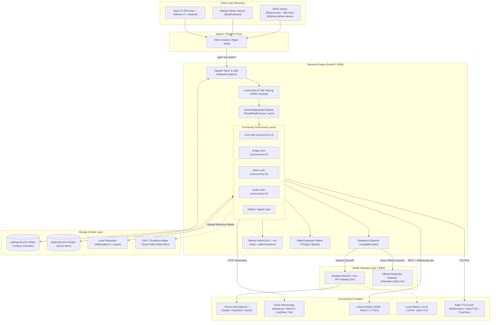
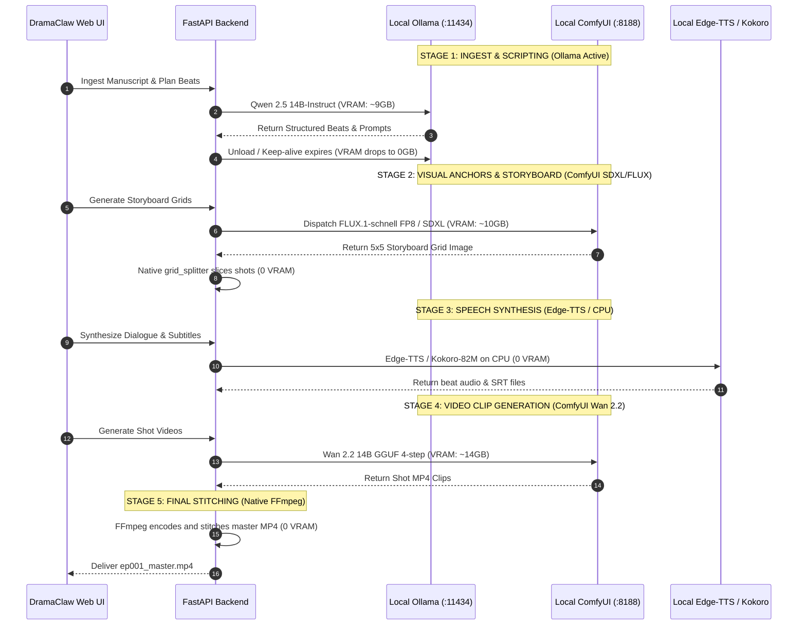

# DRAMACLAW: EXHAUSTIVE ARCHITECTURAL AUDIT & PIPELINE MAPPING

> **Document Version**: 2.0.4-audit  
> **Repository Target**: `C:\Users\ansel\Documents\dramaclaw`  
> **Branch**: `custom-local` (tracking `origin/custom-local`, upstream: `https://github.com/dramaclaw/dramaclaw.git`)  
> **Target Hardware Profile**: Local Workstation / NVIDIA RTX 3090 (24GB VRAM) / Windows 11 Bare-Metal

---

## TABLE OF CONTENTS
1. [Executive Summary & High-Level Architecture](#1-executive-summary--high-level-architecture)
2. [Deep-Dive Dimension Audit (7 Dimensions)](#2-deep-dive-dimension-audit)
   - [2.1 AI Models, Engines & Providers](#21-ai-models-engines--providers)
   - [2.2 ComfyUI & External Orchestration vs. Native Code](#22-comfyui--external-orchestration-vs-native-code)
   - [2.3 End-to-End Pipeline & Data Contracts](#23-end-to-end-pipeline--data-contracts)
   - [2.4 Docker Architecture & Bare-Metal Windows Feasibility](#24-docker-architecture--bare-metal-windows-feasibility)
   - [2.5 Hardware, Memory & VRAM Footprint Analysis](#25-hardware-memory--vram-footprint-analysis)
   - [2.6 System Architecture, IPC & Storage Topology](#26-system-architecture-ipc--storage-topology)
   - [2.7 Director World (3DGS) & Xia Director (Hermes/MCP)](#27-director-world-3dgs--xia-director-hermesmcp)
3. [Component & Model Catalog](#3-component--model-catalog)
4. [Pipeline Flow & Data Contracts (Stage-by-Stage)](#4-pipeline-flow--data-contracts-stage-by-stage)
5. [Docker vs. Native Windows/Conda Assessment](#5-docker-vs-native-windowsconda-assessment)
6. [Local Adaptation Strategy for NVIDIA RTX 3090 (24GB VRAM)](#6-local-adaptation-strategy-for-nvidia-rtx-3090-24gb-vram)
7. [Audit Summary & Actionable Recommendations](#7-audit-summary--actionable-recommendations)

---

## 1. Executive Summary & High-Level Architecture

DramaClaw (historically rooted in the SuperTale engine, package name `supertale-ce` / `novelvideo`) is a source-available, industrialized generative drama production pipeline. The platform operates on a **dual-track paradigm**:
1. **XiaJi (Series Pipeline)**: A deterministic, structured multi-stage assembly line that ingests literary manuscripts or screenplays (Fountain), conducts automated narrative breakdown into visual beats, establishes character and scene visual identity anchors, produces multi-panel storyboard grids, synthesizes multi-speaker clone voiceover, dispatches video clip generation (I2V / FLF), and executes final assembly (Ken Burns motion, subtitle burn-in, audio mixing) via native FFmpeg subprocesses.
2. **XiaHua (Infinite Canvas)**: An interactive, node-based visual workspace (`@xyflow/react` / React Flow v12) supporting 18 node types (Image Gen, Storyboard, Beat Context, Video Compose, 360° Panorama Viewer, 3D Gaussian Splatting World, Grouping, Audio) with two-way sync to the Series asset library.

### High-Level Architectural Diagram



---

## 2. Deep-Dive Dimension Audit

### 2.1 AI Models, Engines & Providers

The system isolates model access behind an OpenAI-compatible runtime interface managed by `src/novelvideo/model_gateway_runtime.py`, `src/novelvideo/model_gateway_settings.py`, and `src/novelvideo/config.py`. Endpoints are **not hardcoded**; they support arbitrary `base_url` redirection, model remapping, and upstream credentials.

```
[Agent / Feature Layer]
       │ (Calls logical model names: DC-*-LLM, LingShan-*, Seedance-*)
       ▼
[novelvideo.config.get_pydantic_model / get_newapi_text_pydantic_model]
       │ (Configures AsyncOpenAI with custom base_url & api_key)
       ▼
[settings.db / model_gateway_settings]
       ├─ Mode: "official" ──► RelayClaw (https://relayclaw.cdnfg.com/v1)
       ├─ Mode: "custom"   ──► Local NewAPI (:3000/v1) or Direct (Ollama / vLLM)
       └─ Mode: "hybrid"   ──► Official LLM/Media + Local ComfyUI Video Models
```

#### 1. LLM / Story & Script Engine
- **Framework**: `pydantic-ai-slim[anthropic,google,openai,openrouter]==1.107.0` paired with `openai>=2.29.0`. All agent pipelines instantiate `Agent(get_pydantic_model(), ...)` which provisions an `OpenAIChatModel` pointed to the active gateway base URL.
- **Logical Feature Models**:
  - `DC-character-builder-LLM`: Character entity extraction, traits, physical appearance descriptions.
  - `DC-scene-builder-LLM`: Scene segmentation, environment prompt generation, lighting conditions.
  - `DC-episode-scene-planner-LLM` & `DC-episode-prop-planner-LLM`: Episode asset planning.
  - `DC-identity-cast-planner-LLM`, `DC-identity-analysis-planner-LLM`, `DC-identity-appearance-writer-LLM`: Character costume/state variants across episodes.
  - `DC-literal-beat-meta-LLM`: Visual beat decomposition and timing estimation.
  - `DC-video-prompt-optimizer-LLM` & `DC-seedance2-prompt-composer-LLM`: Shot prompt generation and syntax compilation.
  - `DC-style-analyzer-LLM`: Style reverse-engineering from user-uploaded reference images.
  - `DC-freezone-translator-LLM` & `DC-freezone-text-writer-LLM`: XiaHua canvas prompts.
  - `DC-hermes-LLM`: Xia Director agent conversation and orchestration.
- **Local Inference Compatibility**: Fully supports local inference servers. Because `AsyncOpenAI(base_url=..., api_key=...)` is used, any endpoint serving `/v1/chat/completions` (Ollama, vLLM, LM Studio, aphrodite, llama.cpp server) can satisfy all text LLM requests.

#### 2. Image Generation & Visual Consistency
- **Default Models**:
  - `LingShan-G2` (internal alias: `gpt-image-2`, `huimeng_gpt_image2`): General high-fidelity rendering.
  - `LingShan-NB-2` / `LingShan-NB-Pro` (`nano-banana-2`): Multi-shot identity anchor model.
  - `seedream-4.5`, `seedream-5.0-pro`, `seedream-5.0-lite`: ByteDance Volcengine visual generation models (`VolcengineImageGenerator`).
  - `seededit-3.0`: Image-to-image editing and inpainting.
- **Identity Locking & Visual Consistency Architecture**:
  1. **Character Identity Turnarounds**: `nanobanana_character.py` compiles a composite reference anchor (`create_composite_reference`) combining front, side, and back full-body/portrait renders.
  2. **Multi-Panel Storyboard Grids**: `nanobanana_grid.py` prompts the model to generate a 25-shot (5x5) or 9-shot (3x3) coherent grid in a single pass. Generating characters within the same latent diffusion canvas guarantees uniform lighting, costume consistency, and facial geometry.
  3. **Algorithmic Grid Splitting**: `grid_splitter.py` applies NumPy luminance variance detection (`_trim_outer_border`) to locate gutter boundaries, isolate panels, and save individual clean frames without cross-shot drift.
  4. **Spatial Set Locking (Director World)**: 360° equirectangular panoramas (`pano_360.png`) and 3D Gaussian Splats lock geometry so cameras framed from different angles look at the exact same physical space.

#### 3. Video Generation (I2V / T2V / FLF)
- **Cloud Models (RelayClaw / NewAPI)**:
  - `seedance-1.0-pro-fast`, `seedance-1.5-pro`, `seedance-2.0`, `seedance-2.0-fast`, `seedance-2.5`: ByteDance Doubao video models supporting text-to-video, first-frame image-to-video, audio-conditioned generation, and multi-reference video editing.
  - `wan3.0-video`, `wan3.0-video-prime`: Alibaba Wan 3.0 video generation models.
  - `MiniMax-H3` (Hailuo): MiniMax video generation.
  - `happyhorse-1.0`, `happyhorse-1.1`: Kuaishou Kling video model wrappers.
- **Local Inference Models**:
  - `Wan 2.2 5B / 14B` (via embedded ComfyUI templates: GGUF 4-step LightX2V and FP8).
  - `LTX-Video 2.3` (via ComfyUI).
- **Supported Generation Modes**: `text_to_video`, `image_to_video`, `first_frame` (I2V), `first_last_frame` (FLF / interpolation between shot first and last frames), `image_reference` (up to 30 images), `all_reference` (image + audio + video + camera movement), and `video_edit`.

#### 4. Audio & TTS
- **TTS Engines**:
  - **Edge-TTS** (`novelvideo.generators.tts_generator.EdgeTTSGenerator`): Free, zero-API-key TTS via Microsoft Edge WebSockets. Directly yields sentence boundaries and word-level timestamps (`edge_tts.SubMaker`), auto-exporting synchronized `.srt` subtitle files.
  - **IndexTTS2** (`novelvideo.generators.indextts2_fal.py` & `novelvideo.audio.indextts2_beat_audio_task.py`): Character voice-cloning engine. References audio files stored at `assets/characters/{character}/identities/{identity}_voice.{mp3,wav}` to clone speech per dialogue beat.
  - **CosyVoice** (`novelvideo.generators.tts_generator.CosyVoiceTTSGenerator`): Alibaba DashScope CosyVoice v3 plus engine.
  - **DoubaoAudio (`seed-audio-1.0`)**: Supported through NewAPI custom routing.
- **Dialogue Timing & Subtitles**: Timings are determined by `ffprobe -show_entries format=duration` on generated MP3s. Dialogue and narration beats generate matching SRT files used in the final composition pass.

---

### 2.2 ComfyUI & External Orchestration vs. Native Code

DramaClaw features **two distinct, production-grade integration vectors** for ComfyUI:

#### Vector A: Direct Native WebSocket/REST Client (`ComfyUIVideoGenerator`)
Located in `src/novelvideo/generators/video_generator.py` (lines 3854–4420):
- Communicates directly with a running ComfyUI server instance over HTTP (`/upload/image`, `/prompt`, `/history`, `/view`) and WebSockets (`/ws?clientId=...`).
- Inspects node progress and execution status in real time.
- Bundled with 4 checked-in production workflow JSON files (in API format):
  1. `wan2-2-I2V-GGUF-LightX2V.json`: Wan 2.2 GGUF quantized model with LightX2V 4-step LoRA for low VRAM (~8GB VRAM).
  2. `wan2-2-I2V-LightX2V.json`: Wan 2.2 FP8 high-quality single-frame I2V (~16GB VRAM).
  3. `wan2-2-FLF-LightX2V.json`: Wan 2.2 First-Last Frame (FLF) transition model taking start and end frames (`~16GB VRAM`).
  4. `ltx2-3-I2V.json`: Lightricks LTX-Video 2.3 I2V workflow.
- Node ID mappings are strictly parameterized:
  ```python
  NODE_MAPPING = {
      "gguf": {"input_image": "62", "frame_count": "63", "positive_prompt": "6", "seed": "57", "video_output": "61"},
      "fp8_i2v": {"input_image": "34", "frame_count": "20", "positive_prompt": "29", "seed_high": "94", "seed_low": "96", "video_output": "19"},
      "fp8_flf": {"first_image": "119", "last_image": "125", "positive_prompt": "6", "seed": "57", "video_output": "67"},
      "ltx23": {"input_image": "98", "frame_count": "167:146", "positive_prompt": "167:164", "seed_high": "167:135", "video_output": "75"}
  }
  ```

#### Vector B: Gateway-Managed ComfyUI Channel (`NewAPI ComfyUI Channel 63`)
- DramaClaw's custom gateway (`dramaclaw-gateway`) includes channel type `63` (ComfyUI adapter).
- The web UI allows users to upload ComfyUI API JSON workflows directly under **Settings → Models & Channels → ComfyUI Workflows**.
- Workflows are persisted to NewAPI's SQLite database (`one-api.db`), allowing DramaClaw's video runners to invoke local ComfyUI workflows through standard OpenAI-compatible `/v1/video/generations` endpoints.

#### Native Python vs. External Tooling Boundary
| Component | Pure Native Python | External Tool / Process | Notes |
|---|:---:|:---:|---|
| Script Planning & Prompts | Yes | None | Pure Python + PydanticAI + AsyncOpenAI |
| Ingest & Graph Parsing | Yes | None | Regex, Fountain parser, SQLite |
| Image Slicing & Grid Logic | Yes | Pillow, NumPy | Luminance thresholding, border cropping |
| Task Queues & Workers | Yes | None (in CE) | `ThreadPoolExecutor`, `deque`, `asyncio` |
| Video Stitching & Subtitles | Partial | `ffmpeg`, `ffprobe` | Invoked via `run_project_subprocess` |
| Video Generation (Cloud) | Yes | Cloud REST APIs | Async HTTP requests via `httpx` |
| Video Generation (Local) | Orchestration only | `ComfyUI` (:8188) | Native Python drives ComfyUI via WebSocket |
| 3D Gaussian Splats (World) | Orchestration only | `ml-sharp` + `splat-transform` | Apple ml-sharp (PyTorch) + PlayCanvas npm CLI |
| Voiceover (Edge-TTS) | Yes | Microsoft Edge WSS | Uses `edge_tts` async library |
| Model Gateway | Orchestration only | `dramaclaw-gateway` | Compiled Go binary (One-API fork) |

---

### 2.3 End-to-End Pipeline & Data Contracts

The complete production lifecycle transitions through 8 distinct stages. Every stage is checkpointed to `project.db` and the filesystem, allowing arbitrary resumption or offline execution:

```
[Manuscript / Screenplay]
       │ (Stage 1: Ingest)
       ▼
[NovelEpisode / NovelCharacter / NovelScene] in SQLite
       │ (Stage 2: Beat Planning)
       ▼
[NovelVisualBeat] (Dialogue, Actions, Camera Movements)
       │ (Stage 3: Identity & Scene Anchor Compilation)
       ▼
[Reference Sheets & 360 Panoramas] in assets/
       │ (Stage 4: Visual Authority Prompting)
       ▼
[Storyboard Multi-Shot Grid Image]
       │ (Stage 5: Grid Splitting & Pool Selection)
       ▼
[Shot First-Frames] (beat_XX_sketch.png / render.png)
       │ (Stage 6: Audio Synthesis & Timing)
       ▼
[Audio Tracks & SRT Subtitles] (beat_XX.mp3 + beat_XX.srt)
       │ (Stage 7: Video Clip Generation - I2V/FLF)
       ▼
[Shot Video Clips] (beat_XX.mp4)
       │ (Stage 8: Final Composition)
       ▼
[Final Mastered Episode Video] (output/epXXX.mp4)
```

#### Intermediate Formats & Data Serialization
1. **Database Schema**: Per-project SQLite at `<state_dir>/<user>/<project>/project.db` (or `<data_root>/<project>/project.db`), managed by `novelvideo.sqlite_store.SQLiteStore`. Tables include:
   - `characters`: Attributes, identity variants, reference image mappings, voice references.
   - `scenes`: Master image paths, reverse angles, 360 panorama paths, environment prompts.
   - `episodes`: Episode metadata, titles, beat counts, compilation statuses.
   - `beats`: Dialogue text, speaker ID, visual description, shot type, camera motion, duration, asset reference IDs.
   - `tasks`: Job envelope IDs, state machine flags, logs, output artifact paths.
2. **Directory Layout**:
   ```
   <project_root>/
   ├── project.db                     # SQLite store (single source of truth)
   ├── project_config.json            # Model mappings & project metadata
   ├── assets/
   │   ├── characters/{name}/
   │   │   ├── master.png             # Canonical portrait anchor
   │   │   └── identities/            # Per-episode costume variants
   │   │       ├── default_master.png
   │   │       └── default_voice.mp3  # Voice cloning reference
   │   └── scenes/{scene_name}/
   │       ├── master.png             # Primary angle
   │       ├── reverse_master.png     # 180-degree reverse shot
   │       ├── pano_360.png           # 2:1 Equirectangular panorama
   │       └── world/scene.sog        # 3DGS PlayCanvas splat package
   ├── storyboard/ep001/
   │   ├── grid_5x5.png               # Raw 25-shot storyboard grid
   │   └── beat_01_sketch.png         # Sliced shot first frame
   ├── audio/ep001/
   │   ├── beat_01.mp3                # Synthesized speech
   │   └── beat_01.srt                # Timestamped subtitles
   ├── video/ep001/
   │   └── beat_01.mp4                # Generated I2V shot clip
   └── output/
       └── ep001_master.mp4           # Final compiled episode
   ```
3. **Video Stitching Pipeline**:
   Implemented in `src/novelvideo/generators/video_composer.py`:
   - **Ken Burns Motion**: If static frames exist without video, applies FFmpeg `zoompan` filter expressions (e.g. `zoompan=z='min(zoom+0.001,1.2)':d=150:x='iw/2-(iw/zoom/2)':y='ih/2-(ih/zoom/2)':s=1080x1920:fps=30`).
   - **Clip Normalization**: Rescales all shot clips to unified canvas dimensions (1080x1920 portrait or 1920x1080 landscape) and target framerate (30 fps).
   - **Subtitle Burn-in**: Injects soft or hard subtitles via FFmpeg `-vf subtitles=...`.
   - **Concatenation**: Generates a temporary `concat_list.txt` and executes `ffmpeg -f concat -safe 0 -i concat_list.txt -c:v libx264 -c:a aac output.mp4`.

---

### 2.4 Docker Architecture & Bare-Metal Windows Feasibility

#### Why Docker Was Chosen by DramaClaw Authors
1. **Multi-Service Topology**: A complete DramaClaw deployment bundles 3 distinct components:
   - `api`: FastAPI backend in Python 3.12 (`dramaclaw:2.0.4`).
   - `newapi`: Go-compiled API gateway (`dramaclaw-gateway:v1.0.0-rc.24-dramaclaw.2`).
   - `web`: Nginx reverse proxy serving the pre-compiled React SPA (`dramaclaw-frontend:2.0.4`).
2. **System Dependencies**: Out-of-the-box Debian image bundles `ffmpeg`, `ffprobe`, `git`, `nodejs`, `npm`, and `@playcanvas/splat-transform`.
3. **Reproducible Environment**: Pins Linux file paths (`/data`), environment isolation (`ST_EDITION=ce`), and container networking (`http://newapi:3000`, `http://api:8780`).

#### Critical Bare-Metal Windows Feasibility Evaluation
Can we bypass Docker and run DramaClaw directly on Windows bare-metal using a dedicated Conda environment?

> [!CAUTION]
> **Python Version Blocker**: Attempting to use `conda create -n dramaclaw_env python=3.10` **WILL FAIL IMMEDIATELY**.  
> In `pyproject.toml` line 10, the runtime constraint is strictly declared:  
> `requires-python = ">=3.11,<3.13"`  
> Furthermore, dependencies such as `pydantic-ai-slim==1.107.0`, `cognee==1.0.5`, and `asyncpg` require Python 3.11+.  
> **Resolution**: You MUST create the Conda environment with **`python=3.11`** (or `python=3.12`), e.g.:  
> `conda create -n dramaclaw_env python=3.11`

#### Detailed Breakdown of Windows Bare-Metal Blockers & Workarounds

| Subsystem | Docker/Linux Assumption | Windows Bare-Metal Reality | Severity | Exact Workaround |
|---|---|---|:---:|---|
| **Python Version** | Python 3.12 container | Host has 3.13; prompt proposed 3.10 | **BLOCKER** | `conda create -n dramaclaw_env python=3.11` |
| **Package Resolution** | `uv sync` in Docker | Plain `pip` ignores `[[tool.uv.dependency-metadata]]` | **CRITICAL** | Run `uv sync --group dev` inside Conda; do not use raw `pip install -e .` |
| **FFmpeg / ffprobe** | Installed via `apt-get` | Must exist in Windows `PATH` | **CRITICAL** | `winget install Gyan.FFmpeg` and verify `ffmpeg -version` in PowerShell |
| **Subtitle Fonts** | Hardcoded `/System/Library/Fonts` or `/usr/share/fonts` | Paths don't exist on Windows; `_drawtext_fontfile_arg` returns `""` | **WARNING** | FFmpeg might fail rendering Chinese text. Patch `_drawtext_fontfile_arg()` to include `C:/Windows/Fonts/msyh.ttc` (Microsoft YaHei) |
| **Process Termination** | `os.killpg(pid, SIGKILL)` | Windows lacks `killpg` | **RESOLVED** | `subprocesses.py` already includes native `taskkill /PID {pid} /T /F` logic for Windows (`os.name == 'nt'`) |
| **NewAPI Gateway** | Precompiled Linux Go container on port 3000 | Go binary not installed on Windows | **MEDIUM** | Option A: Run `dramaclaw-gateway` binary for Windows or One-API `.exe`. Option B: Run in Official mode (points directly to `https://relayclaw.cdnfg.com/v1`). Option C: Point `NEWAPI_BASE_URL` directly to Ollama/vLLM |
| **Frontend Server** | Nginx container on port 8080 | Nginx not running on Windows host | **LOW** | Run `pnpm dev` inside `frontend/` (port 5173 with Vite proxy to `:8780`) or `pnpm build` + `serve -s dist -l 8080` |
| **Splat Transform** | Linux `npm install -g @playcanvas/splat-transform` | Requires Node.js on Windows | **OPTIONAL** | Only needed if using 3DGS Director World: `npm install -g @playcanvas/splat-transform` |

**Conclusion**: Running bare-metal on Windows is **100% feasible**, provided:
1. Python 3.11 is used instead of 3.10.
2. `uv` handles dependencies.
3. System `ffmpeg` is present.
4. The frontend is run via Vite dev server or local static server.

---

### 2.5 Hardware, Memory & VRAM Footprint Analysis

#### Why DramaClaw Claims Low Resource Usage (~4GB RAM)
The repository's claim of running on modest hardware (e.g. 4GB RAM) is completely genuine for its default configuration because **zero deep learning models run locally**:
- All LLM inference (PydanticAI) is dispatched over HTTP to RelayClaw, OpenAI, or Volcengine.
- All image synthesis (LingShan, Seedream) is offloaded to remote cloud clusters.
- All video synthesis (Seedance, Wan 3.0, MiniMax) runs on cloud GPU farms.
- Edge-TTS operates via lightweight streaming WebSocket calls.
- The local machine only handles:
  1. Python FastAPI runtime + Uvicorn ASGI server (~150MB RAM).
  2. SQLite file transactions (~50MB RAM).
  3. Image cropping and luminance math in Pillow/NumPy (~200MB RAM during slicing).
  4. FFmpeg audio/video demuxing and encoding (~300MB–800MB RAM).
  5. Browser React frontend (~500MB RAM).
- Total idle footprint: **~1.2 GB RAM, 0 MB VRAM**. Total peak generation footprint: **~3.5 GB RAM, 0 MB VRAM**.

---

### 2.6 System Architecture, IPC & Storage Topology

#### Framework Stacks
- **Backend**: FastAPI `>=0.128.0`, Uvicorn ASGI, Typer CLI (`supertale-ce` / `novelvideo`).
- **Frontend**: React 19.1, TypeScript 5.8, Vite 6.3, Tailwind CSS v4, `@xyflow/react` (React Flow v12), `@radix-ui`, `zustand` 5.0, `@tanstack/react-query`, `@tanstack/react-router`, `ky` HTTP client, `framer-motion`, `gsap`, `playcanvas` 2.18, `@photo-sphere-viewer/core`.
- **Database**:
  - Global runtime settings: `<state_dir>/local/settings.db` (SQLite).
  - Project repository: `<project_dir>/project.db` (SQLite via `aiosqlite`).
  - Gateway configuration: `one-api.db` (SQLite via NewAPI).

#### Inter-Process Communication (IPC) & Task Concurrency
In Community Edition (`ST_EDITION=ce`):
- Celery and Redis are **completely eliminated**.
- `InlineTaskBackend` (`src/novelvideo/ports/local/tasks.py`) acts as the in-process task scheduler.
- Each queue kind (`QUEUE_KINDS`: `llm`, `image`, `video`, `audio`, `default`) is assigned an independent `ThreadPoolExecutor` and in-memory `collections.deque` job queue.
- Jobs are wrapped in HMAC-signed `TaskEnvelope` structures (`task_backend/envelope.py`) to prevent tampering.
- Subprocesses spawned by runners (e.g., FFmpeg) are registered in a central registry (`subprocesses.py`) and tied to task IDs. When a user cancels a task via the UI, `taskkill /PID {pid} /T /F` immediately purges the active process tree.
- Streaming updates to the browser use **Server-Sent Events (SSE)** via `sse-starlette`.

---

### 2.7 Director World (3DGS) & Xia Director (Hermes/MCP)

#### Director World (Spatially Consistent Sets)
Located in `src/novelvideo/director_world/`:
- **Problem Solved**: Generative video models suffer from catastrophic spatial hallucination when cutting between different angles of the same room.
- **Solution**:
  1. A 360° panorama (`pano_360.png`) is split into a 6-face cubemap.
  2. Apple `ml-sharp` (`haodongli/DA-2` depth estimation + `sharp_2572gikvuh.pt`) predicts 3D Gaussian Splats for each cubemap view (`pano_sharp.py`).
  3. Splats are merged into a single point cloud and compressed via PlayCanvas `@playcanvas/splat-transform` into a `.sog` package.
  4. The web frontend renders the 3D set in the browser using PlayCanvas.
  5. The director positions a virtual camera, captures an exact frame, and passes that framed capture as an identity anchor for subsequent shot generation.

#### Xia Director & MCP Integration
Located in `src/novelvideo/chat/`:
- Integrates `hermes-agent[acp]` and `claude-agent-sdk`.
- Hosts a Model Context Protocol (MCP) server (`dramaclaw_mcp.py`) exposing DramaClaw tools to external AI agents (Claude Code, Cursor, Codex, Xia Director) over loopback JSON-RPC.

---

## 3. Component & Model Catalog

| Pipeline Component | Role in Production Line | Default Provider / Model | Local / Free Alternative ($0 Cost) |
|---|---|---|---|
| **Novel / Script Ingest** | Extract characters, scenes, plot structure | `DC-character-builder-LLM` / `DC-scene-builder-LLM` | **Qwen 2.5 14B-Instruct** (via Ollama / vLLM) |
| **Beat Decomposition** | Break scenes into visual shots, action, dialogue | `DC-literal-beat-meta-LLM` | **Qwen 2.5 32B-Instruct** (Q4_K_M) or **DeepSeek-R1-Distill-Qwen-14B** |
| **Shot Prompt Optimizer** | Translate beats into precise diffusion prompts | `DC-video-prompt-optimizer-LLM` | **Qwen 2.5 7B / 14B-Instruct** |
| **Character Reference** | Establish facial and physical identity anchors | `LingShan-NB-2` / `LingShan-G2` | **FLUX.1-dev / schnell (FP8)** + **InstantID / IP-Adapter** |
| **Storyboard Generation** | 5x5 multi-panel consistent shot layout | `nanobanana_grid` / `LingShan-NB-2` | **SDXL Turbo / RealVisXL** in ComfyUI with 5x5 Grid Prompt |
| **Grid Slicing** | Algorithmic panel isolation without drift | Native Pillow / NumPy (`grid_splitter.py`) | **Native Code** (Built-in, $0, 0 VRAM) |
| **Video Generation (I2V)** | First-frame image to motion video clip | `seedance-1.0-pro-fast` / `wan3.0-video` | **Wan 2.2 14B / 5B GGUF** (via native ComfyUI integration) |
| **Video Transition (FLF)** | Interpolation between shot start & end frames | `seedance-2.5` / `wan3.0-video` | **Wan 2.2 FLF LightX2V** (via native ComfyUI template) |
| **Narration / Dialogue TTS** | Voice synthesis & subtitle timestamping | `index-tts-2` / `edge-tts` | **Edge-TTS** (Built-in, $0, 0 VRAM) or **Kokoro-82M** |
| **Voice Cloning** | Multi-speaker dialogue conditioned on actor clips | `index-tts-2` (via NewAPI / fal.ai) | **CosyVoice 300M** / **F5-TTS** (local ComfyUI or Python) |
| **Spatial Sets (3DGS)** | 3D Gaussian Splat scene reconstruction | Apple `ml-sharp` + `haodongli/DA-2` | **DA-2 + ml-sharp** (Built-in via `INSTALL_WORLD=1`) |
| **Final Composition** | Ken Burns, subtitle burn, audio mix, concat | Native `ffmpeg` subprocesses | **Native FFmpeg** (Built-in, $0, 0 VRAM) |
| **Agent / Orchestrator** | Xia Director conversational project driver | `DC-hermes-LLM` / Claude Agent SDK | **Hermes Agent** + **Qwen 2.5 14B** |

---

## 4. Pipeline Flow & Data Contracts (Stage-by-Stage)

### Stage 1: Manuscript / Screenplay Ingestion
- **Trigger**: User uploads `.txt`, `.docx`, or `.fountain` file via UI or `/api/v1/projects/{id}/ingest`.
- **Runner**: `src/novelvideo/task_backend/runners/ingest.py`.
- **Contract / Payload**:
  - *Input*: `{"source_path": "uploads/manuscript.txt", "title": "My Story", "mode": "structured_v1"}`
  - *Processing*: Regex / NLP splitting into chapters; LLM extracts characters (`NovelCharacter`), scenes (`NovelScene`), and episode boundaries (`NovelEpisode`).
  - *Output*: Populated tables `characters`, `scenes`, `episodes` in `project.db`.

### Stage 2: Script & Visual Beat Planning
- **Trigger**: User initiates episode script generation via `/api/v1/projects/{id}/episodes/{num}/script`.
- **Runner**: `src/novelvideo/task_backend/runners/script.py`.
- **Contract / Payload**:
  - *Input*: `{"episode_number": 1, "target_duration_seconds": 120, "mode": "adaptive"}`
  - *Processing*: `EpisodePlannerAgent` expands episode outline into narrative beats. Each beat receives speaker attribution, dialogue lines, visual action, environment, and shot type.
  - *Output*: Array of `NovelVisualBeat` records committed to `project.db`.

### Stage 3: Character & Scene Identity Compilation
- **Trigger**: Script confirmation triggers asset compilation.
- **Runner**: `character_image.py`, `scene_reference.py`, `stage_asset.py`.
- **Contract / Payload**:
  - *Input*: Character physical description, costume style, scene environment prompt.
  - *Processing*: Image generation creates master turnaround sheets. 360 panorama generator renders `pano_360.png`.
  - *Output*: `assets/characters/{char}/identities/{identity}_master.png`, `assets/scenes/{scene}/master.png`, `pano_360.png`.

### Stage 4: Visual Storyboard Generation & Grid Splitting
- **Trigger**: Storyboard rendering task enqueued.
- **Runner**: `sketch.py` and `render.py`.
- **Contract / Payload**:
  - *Input*: Beat sheet + visual style keywords + character identity anchor images.
  - *Processing*: `nanobanana_grid.py` compiles multi-reference prompt and outputs a 5x5 grid image (`grid_5x5.png`). `grid_splitter.py` runs threshold detection, slices the 25 frames, and indexes them in `pool_indexer.py`.
  - *Output*: `storyboard/ep{num}/beat_{num:02d}_sketch.png` and `beat_{num:02d}_render.png`.

### Stage 5: Audio Synthesis & Word-Level Timing
- **Trigger**: Audio lane enqueues dialogue generation.
- **Runner**: `src/novelvideo/task_backend/runners/audio.py`.
- **Contract / Payload**:
  - *Input*: Dialogue string, speaker ID, reference voice file path (for clone).
  - *Processing*: `EdgeTTSGenerator` or `indextts2_beat_audio_task.py` executes synthesis. `SubMaker` generates synchronized SRT subtitle text.
  - *Output*: `audio/ep{num}/beat_{num:02d}.mp3` and `beat_{num:02d}.srt`.

### Stage 6: Video Clip Generation (I2V / FLF)
- **Trigger**: Video lane dispatches clip rendering.
- **Runner**: `src/novelvideo/task_backend/runners/video.py`.
- **Contract / Payload**:
  - *Input*:
    ```json
    {
      "image_path": "storyboard/ep001/beat_01_render.png",
      "last_frame_path": null,
      "prompt": "Camera slowly pushes in, character looks toward window with subtle smile",
      "duration": 4.5,
      "model": "wan2.2-i2v-gguf",
      "reference_audio": "audio/ep001/beat_01.mp3"
    }
    ```
  - *Processing*: Dispatches to `ComfyUIVideoGenerator` (WebSocket progress monitoring) or Cloud API.
  - *Output*: `video/ep001/beat_01.mp4`.

### Stage 7: Final Episode Composition & Mastering
- **Trigger**: All beat clips confirmed in workbench.
- **Runner**: `novelvideo.generators.video_composer.VideoComposer`.
- **Contract / Payload**:
  - *Input*: List of `SceneAsset(scene_number, image_path, audio_path, video_path, subtitle_path, duration)`.
  - *Processing*:
    1. Rescale and standardize all shot video clips to target format (e.g. 1080x1920, 30fps, libx264).
    2. Apply Ken Burns zoom/pan to any static storyboard fallbacks.
    3. Generate 3-second animated title card and 2-second end card.
    4. Burn in subtitles using FFmpeg drawtext or subtitles filter.
    5. Execute FFmpeg stream concatenation demuxer.
  - *Output*: `output/ep001_master.mp4`.

---

## 5. Docker vs. Native Windows/Conda Assessment

### Feasibility Scorecard

| Dimension | Docker Setup | Native Windows / Conda Setup |
|---|:---:|:---:|
| **Setup Complexity** | Low (`docker compose up -d`) | Moderate (Requires Git, Conda, Node, FFmpeg) |
| **GPU Acceleration (NVIDIA)** | Needs WSL2 + NVIDIA Container Toolkit | **Direct native CUDA (Fastest, zero virtualization overhead)** |
| **VRAM Efficiency** | WSL2 driver overhead (~1.5GB VRAM penalty) | **100% of 24GB VRAM accessible to PyTorch & ComfyUI** |
| **File I/O Performance** | WSL2 mount translation overhead on Windows drives | **Direct Windows NTFS speeds** |
| **ComfyUI Local Hookup** | Needs `host.docker.internal` networking | **Simple `127.0.0.1:8188` loopback** |

### Step-by-Step Bare-Metal Windows Setup Blueprint

#### Step 1: Install System Prerequisites
1. **FFmpeg**:
   ```powershell
   winget install Gyan.FFmpeg
   # Restart PowerShell and verify:
   ffmpeg -version
   ffprobe -version
   ```
2. **Node.js & Splat Transform** (Optional, for 3DGS Director World):
   ```powershell
   winget install OpenJS.NodeJS.LTS
   npm install -g @playcanvas/splat-transform
   ```

#### Step 2: Create Dedicated Python 3.11 Conda Environment
> **Do not use Python 3.10** (breaks `requires-python = ">=3.11,<3.13"`).
```powershell
conda create -n dramaclaw_env python=3.11 -y
conda activate dramaclaw_env
```

#### Step 3: Install `uv` and Synchronize Dependencies
```powershell
pip install uv
cd C:\Users\ansel\Documents\dramaclaw

# Use uv sync to respect all dependency overrides (da2/sharp/torch)
uv sync --group dev
```

#### Step 4: Configure Local Environment (`.env`)
Copy `.env.example` to `.env` and set bare-metal paths:
```ini
ST_EDITION=ce
ST_CONTROL_PLANE_DSN=
ST_REDIS_URL=
ST_CELERY_BROKER_URL=

# Point storage to local Windows directory
NOVELVIDEO_DATA_ROOT=C:\Users\ansel\Documents\dramaclaw\data
NOVELVIDEO_OUTPUT_DIR=C:\Users\ansel\Documents\dramaclaw\data\output
NOVELVIDEO_STATE_DIR=C:\Users\ansel\Documents\dramaclaw\data\state
NOVELVIDEO_RUNTIME_DIR=C:\Users\ansel\Documents\dramaclaw\data\runtime

# Disable containerized provisioner
NEWAPI_PROVISIONER_ENABLED=false
PROMPT_EXPORT_PASSWORD=your_secure_password_here

# Local ComfyUI address
COMFYUI_ADDRESS=127.0.0.1:8188
COMFYUI_USE_SSL=false
```

#### Step 5: Start the Backend API
```powershell
conda activate dramaclaw_env
uv run novelvideo api --host 127.0.0.1 --port 8780
```

#### Step 6: Start the Frontend UI
In a separate terminal:
```powershell
cd C:\Users\ansel\Documents\dramaclaw\frontend
corepack enable
pnpm install
# Start local Vite dev server (reverse-proxies /api to 127.0.0.1:8780)
pnpm dev --port 8080
```

---

## 6. Local Adaptation Strategy for NVIDIA RTX 3090 (24GB VRAM)

The goal is to operate DramaClaw **100% locally with zero cloud API subscriptions ($0 operational cost)** by utilizing the 24GB VRAM on an NVIDIA GeForce RTX 3090.

### The 24GB VRAM Concurrency Challenge
Running a 14B LLM (~9GB VRAM), an Image Diffusion Model (~8GB VRAM), and a Video Diffusion Model (~14GB VRAM) simultaneously would require **~31GB VRAM**, exceeding the 24GB physical capacity.

### The Solution: Stage-by-Stage Dynamic Memory Offloading



### Exact Module Rewiring Specifications

#### 1. Rewiring LLMs to Local Ollama
- **Local Tool**: Install Ollama on Windows (`ollama run qwen2.5:14b-instruct`).
- **Ollama VRAM Footprint**: ~9.2 GB (Q4_K_M quantization).
- **Configuration in DramaClaw**:
  Open `http://localhost:8080` → **Settings → Models & Channels → Custom**:
  - In NewAPI, add an `OpenAI` channel with Base URL `http://127.0.0.1:11434/v1` and dummy API key `ollama`.
  - Map feature models (`DC-character-builder-LLM`, `DC-scene-builder-LLM`, `DC-literal-beat-meta-LLM`, `DC-video-prompt-optimizer-LLM`) to `qwen2.5:14b-instruct`.
  - Set environment variable `OLLAMA_KEEP_ALIVE=5m` so the model automatically vacates VRAM when script generation finishes.

#### 2. Rewiring Image Generation to Local ComfyUI (SDXL / FLUX)
- **Local Tool**: Standalone ComfyUI running on port 8188 with `comfyui-flux` or `SDXL-Turbo`.
- **ComfyUI VRAM Footprint**: ~9–11 GB.
- **Workflow**: Create an API JSON workflow with standard KSampler + CLIP Text Encode.
- **Configuration in DramaClaw**:
  In `src/novelvideo/config.py` and `official_media_models.json`, map `LingShan-NB-2` to route through the ComfyUI channel.

#### 3. Rewiring Video Generation to Native Wan 2.2 ComfyUI Templates
- **DramaClaw Already Includes Checked-In Workflows**:
  - `src/novelvideo/generators/wan2-2-I2V-GGUF-LightX2V.json`
  - `src/novelvideo/generators/wan2-2-FLF-LightX2V.json`
- **ComfyUI VRAM Footprint**:
  - Wan 2.2 14B GGUF (Q4): **~13.5 GB VRAM** (fits comfortably in 24GB).
  - Wan 2.2 5B FP8: **~8.5 GB VRAM**.
- **Execution**:
  Set environment variable in `.env`:
  ```ini
  VIDEO_BACKEND=comfyui
  COMFYUI_WORKFLOW=gguf
  COMFYUI_ADDRESS=127.0.0.1:8188
  COMFYUI_USE_SSL=false
  ```
  `ComfyUIVideoGenerator` will automatically upload sliced storyboard frames to `http://127.0.0.1:8188/upload/image`, submit the GGUF LightX2V workflow, monitor generation over WebSocket `/ws`, and pull the finished `.mp4` from `/view`.

#### 4. Rewiring Audio to Edge-TTS / Kokoro
- **Built-in Free Engine**: `EdgeTTSGenerator` is already part of the repository.
- **Operational Cost**: **$0**, zero VRAM required (network streaming).
- **Configuration**:
  Set in `.env`:
  ```ini
  TTS_PROVIDER=edge
  DEFAULT_VOICE=zh-CN-YunxiNeural
  ```
- Generates natural, human-sounding Chinese dialogue and narration while automatically emitting SRT files.

---

## 7. Audit Summary & Actionable Recommendations

### Key Architectural Strengths
1. **Decoupled Gateway Abstraction**: Every LLM, image, video, and audio call routes through clean logical names, allowing seamless switching between official cloud endpoints and local bare-metal models without touching business logic.
2. **Dual-Track Workflow**: XiaHua (infinite canvas) and XiaJi (structured pipeline) share the same SQLite database and asset library, bridging the gap between freeform creative exploration and rigorous production lines.
3. **Robust Local CE Architecture**: Zero reliance on PostgreSQL or Redis for single-node installations. In-process task scheduling with lane-based concurrency control provides enterprise-like task safety on a personal workstation.
4. **Native ComfyUI Wan 2.2 Support**: Built-in GGUF and FP8 LightX2V workflows provide a turnkey route to local video generation on 24GB GPUs.

### Actionable Setup Checklist for Current Workstation

- [x] **Git Remote Configuration**: Added `upstream` (`https://github.com/dramaclaw/dramaclaw.git`) and pushed dedicated dev branch `custom-local` to fork (`origin`).
- [ ] **Python Environment**: Initialize Conda environment with `python=3.11` (do **not** use 3.10 or 3.13).
- [ ] **System Dependencies**: Install FFmpeg via `winget install Gyan.FFmpeg`.
- [ ] **Dependency Sync**: Run `uv sync --group dev` to apply repository package metadata overrides.
- [ ] **Subtitles Font Patch**: Add fallback Windows font paths (`C:/Windows/Fonts/msyh.ttc`) to `_drawtext_fontfile_arg()` in `src/novelvideo/generators/video_composer.py`.
- [ ] **ComfyUI Local Setup**: Launch ComfyUI on `127.0.0.1:8188` with Wan 2.2 GGUF models downloaded to `ComfyUI/models/unet/`.
- [ ] **Ollama Setup**: Launch Ollama with `qwen2.5:14b-instruct` and connect to DramaClaw via Custom Channel settings.
